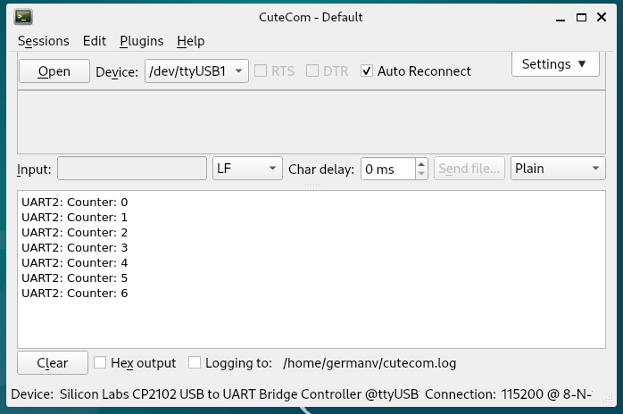
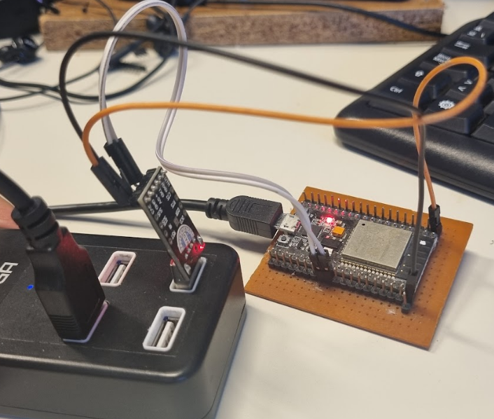

# _Ejemplo simple: Transmicion por puerto UART_
Un ejemplo donde se muestra un contador de segundos por puerto UART. Tambien se configura el blink de un led .

### Receptor/Transmisor Asíncrono Universal (UART)

#### Introducción
Un receptor/transmisor asíncrono universal (UART) es una característica de hardware que maneja la comunicación (es decir, requisitos de sincronización y entramado de datos) utilizando interfaces de comunicación en serie asíncronas ampliamente adoptadas, como RS232, RS422 y RS485. Un UART proporciona un método económico y ampliamente adoptado para realizar el intercambio de datos full-duplex o half-duplex entre diferentes dispositivos.

El chip ESP32 tiene 3 controladores UART (también conocidos como puerto), cada uno con un conjunto idéntico de registros para simplificar la programación y brindar mayor flexibilidad.

Cada controlador UART se puede configurar de forma independiente con parámetros como velocidad en baudios, longitud de bits de datos, orden de bits, número de bits de parada, bits de paridad, etc. Todos los controladores UART normales son compatibles con dispositivos habilitados para UART de varios fabricantes y también pueden admitir infrarrojos. Protocolos de asociación de datos (IrDA).

Para más información, ver la [documentación del fabricante](https://docs.espressif.com/projects/esp-idf/en/stable/esp32/api-reference/peripherals/uart.html).


## Flujo de configuracion cuando estamos queremos usar los puertos UART
La descripción general describe cómo establecer comunicación entre un ESP32 y otros dispositivos UART utilizando las funciones y tipos de datos del controlador UART. Un flujo de trabajo de programación típico se divide en las secciones que se proporcionan a continuación:

- **Establecer parámetros de comunicación** : configuración de velocidad en baudios, bits de datos, bits de parada, etc.

- **Establecer pines de comunicación** : asignación de pines para la conexión a un dispositivo

- **Instalar controladores** : asignación de recursos de ESP32 para el controlador UART

- **Ejecute comunicación UART** : envío/recepción de datos

- **Usar interrupciones** : activar interrupciones en eventos de comunicación específicos

- **Eliminación de un controlador** : liberación de recursos asignados si ya no se requiere una comunicación UART

Los pasos 1 a 3 comprenden la etapa de configuración. El paso 4 es donde la UART comienza a funcionar. Los pasos 5 y 6 son opcionales.


La estrucutura de carpetas de este repositorio es la siguiente

```
├── CMakeLists.txt                  Archivo de ocnfiguracion de la aplicacion
├── main
│   ├── CMakeLists.txt              Archivo de configuracion del modulo main
│   └── main.c
└── README.md                  
```

### Pasos a seguir
En este ejemplo simple vamos a enviar el mensaje de un contador por los pines 17(tx) 16(rx) del UART2. Para ello debemos realizar una seria de pasos:
- Configurar el hardware.
- Configurar los pines para manejar UART2.
- Configurar driver.


## Imagenes

### Monitor CUTECOM



### Circuito



## Requisitos

Para ejecutar estos ejemplos, necesitarás un entorno de desarrollo configurado para la programación de la ESP32, que puede incluir:

- Placa de desarrollo ESP32.
- SDK de Espressif (IDF-ESP32).

### Configurar el autocompletado:

La documentacion para configurar el autocompletado es [documentacion](https://code.visualstudio.com/docs/cpp/c-cpp-properties-schema-reference#_example-of-variables). Resumen: necesitas un archivo `c_cpp_properties.json` en tu carpeta de trabajo con la siguiente configuracion

```
{
    "configurations": [
        {
            "name": "ESP-IDF",
            "compilerPath": "${config:idf.toolsPath}/tools/xtensa-esp-elf/esp-13.2.0_20230928/xtensa-esp-elf/bin/xtensa-esp32-elf-gcc",
            "compileCommands": "${workspaceFolder}/build/compile_commands.json",
            "includePath": [
                "${config:idf.espIdfPath}/components/**",
                "${config:idf.espIdfPathWin}/components/**",
                "${config:idf.espAdfPath}/components/**",
                "${config:idf.espAdfPathWin}/components/**",
                "${workspaceFolder}/**"
            ],
            "browse": {
                "path": [
                    "${config:idf.espIdfPath}/components",
                    "${config:idf.espIdfPathWin}/components",
                    "${config:idf.espAdfPath}/components/**",
                    "${config:idf.espAdfPathWin}/components/**",
                    "${workspaceFolder}"
                ],
                "limitSymbolsToIncludedHeaders": false
            }
        }
    ],
    "version": 4
}
```